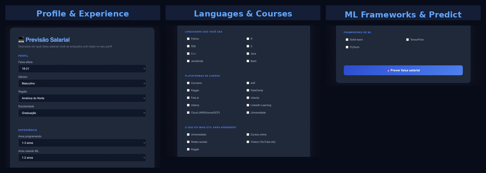

# MVP — Previsão Salarial de Profissionais de Tecnologia

Projeto desenvolvido para a disciplina **Engenharia de Sistemas de Software Inteligentes** da Pós-Graduação PUC-Rio.

## Problema de negócio

> Dado o perfil de formação, habilidades técnicas e região geográfica de um profissional de tecnologia, conseguimos prever em qual faixa salarial ele se enquadra?

A região geográfica foi incluída como feature deliberadamente — o mesmo perfil técnico tem remunerações muito diferentes dependendo do país. Ignorar essa variável geraria um modelo injusto e pouco útil.

## Dataset

- **Fonte:** Kaggle ML & Data Science Survey 2022
- **Respondentes:** ~23.000 profissionais e estudantes de tecnologia de mais de 50 países
- **URL:** https://raw.githubusercontent.com/marianabrockes/mvp_ml/refs/heads/main/notebook/kaggle_survey_2022_responses.csv

## Target

A variável-alvo é a faixa salarial anual agrupada em 3 classes:

| Faixa | Salário anual     |
| ----- | ----------------- |
| Baixo | Até $29.999       |
| Médio | $30.000 – $99.999 |
| Alto  | $100.000+         |

## Resultados

Quatro algoritmos foram treinados, otimizados com GridSearchCV e avaliados no conjunto de teste:

| Algoritmo               | Acurácia (cross-val) | Acurácia (teste) |
| ----------------------- | -------------------- | ---------------- |
| Árvore de Classificação | 68,5%                | **68,1%**        |
| SVM                     | 64,4%                | 63,7%            |
| KNN                     | 60,9%                | 60,9%            |
| Naive Bayes             | 57,4%                | 55,9%            |

O modelo vencedor foi a **Árvore de Classificação** com 68,1% de acurácia no teste.

## Estrutura do projeto

```
mvp_ml/
├── backend/
│   ├── app.py              # API Flask
│   ├── modelo.pkl          # Modelo treinado
│   ├── requirements.txt    # Dependências
│   └── tests/
│       └── test_modelo.py  # Teste PyTest (acurácia e F1-score ≥ 60%)
├── frontend/
│   ├── index.html
│   ├── style.css
│   └── script.js
├── notebook/
│   ├── kaggle_survey_2022_responses.csv
│   └── ml_kaggle_survey_2022.ipynb
└── README.md
```

## Como executar

### Backend

```bash
cd backend
python -m venv venv
source venv/bin/activate
pip install -r requirements.txt
python app.py
```

A API ficará disponível em `http://127.0.0.1:5001`

### Frontend

Abra o arquivo `frontend/index.html` diretamente no navegador.

```bash
open -a "Google Chrome" frontend/index.html
```

### Testes

```bash
cd backend
source venv/bin/activate
pytest tests/test_modelo.py -v
```

O teste verifica dois thresholds mínimos de desempenho:

- **Acurácia ≥ 60%**
- **F1-score ≥ 60%**

## Notebook

O notebook completo pode ser executado diretamente no Google Colab:

[Abrir no Google Colab](https://colab.research.google.com/drive/1bnkEAvfBIKebTpPcRX02qxdWVCu3CYT1?usp=sharing)

# Salary Prediction — Tech Professionals 💻

A machine learning project that predicts which salary bracket a tech professional falls into, based on their profile, experience, programming languages, and learning background.

The model was trained on ~23,000 responses from the Kaggle ML & Data Science Survey 2022, covering professionals from over 50 countries. Geography was included as a deliberate feature — the same technical profile can mean very different salaries depending on region, and ignoring that would make the model both inaccurate and unfair.

---

## Interface



The frontend lets you fill in your profile and get an instant salary bracket prediction from the trained model.

---

## Problem

> Given a tech professional's education, technical skills, learning background, and region — can we predict which salary bracket they fall into?

**Target variable** — annual salary grouped into 3 classes:

| Class | Annual salary     |
| ----- | ----------------- |
| Low   | Up to $29,999     |
| Mid   | $30,000 – $99,999 |
| High  | $100,000+         |

---

## Results

Four algorithms were trained, tuned with GridSearchCV, and evaluated on a held-out test set:

| Algorithm     | Cross-val accuracy | Test accuracy |
| ------------- | ------------------ | ------------- |
| Decision Tree | 68.5%              | **68.1%**     |
| SVM           | 64.4%              | 63.7%         |
| KNN           | 60.9%              | 60.9%         |
| Naive Bayes   | 57.4%              | 55.9%         |

The winning model was the **Decision Tree** with 68.1% test accuracy.

---

## Dataset

- **Source:** Kaggle ML & Data Science Survey 2022
- **Size:** ~23,000 respondents from 50+ countries
- **URL:** [kaggle_survey_2022_responses.csv](https://raw.githubusercontent.com/marianabrockes/mvp_ml/refs/heads/main/notebook/kaggle_survey_2022_responses.csv)

---

## Tech Stack

- **Python 3** — data processing and model training
- **Scikit-learn** — classification algorithms, GridSearchCV, train/test split
- **Pandas / NumPy** — data wrangling
- **Flask** — prediction API
- **PyTest** — automated model performance tests
- **HTML / CSS / JavaScript** — frontend interface

---

## Project Structure

    mvp_ml/
    ├── backend/
    │   ├── app.py              # Flask prediction API
    │   ├── modelo.pkl          # Trained model
    │   ├── requirements.txt
    │   └── tests/
    │       └── test_modelo.py  # PyTest — accuracy and F1 ≥ 60%
    ├── frontend/
    │   ├── index.html
    │   ├── style.css
    │   └── script.js
    ├── notebook/
    │   ├── kaggle_survey_2022_responses.csv
    │   └── ml_kaggle_survey_2022.ipynb
    └── README.md

---

## Running Locally

**Backend**

```bash
cd backend
python3 -m venv venv
source venv/bin/activate
pip install -r requirements.txt
python app.py
```

API available at `http://127.0.0.1:5001`

**Frontend**

```bash
open frontend/index.html
```

**Tests**

```bash
cd backend
source venv/bin/activate
pytest tests/test_modelo.py -v
```

The test suite validates two minimum performance thresholds against the original dataset:

- Accuracy ≥ 60%
- F1-score ≥ 60%

---

## Notebook

Full analysis — data exploration, preprocessing, model training and comparison — available on Google Colab:

[Open in Google Colab](https://colab.research.google.com/drive/1bnkEAvfBIKebTpPcRX02qxdWVCu3CYT1?usp=sharing)
